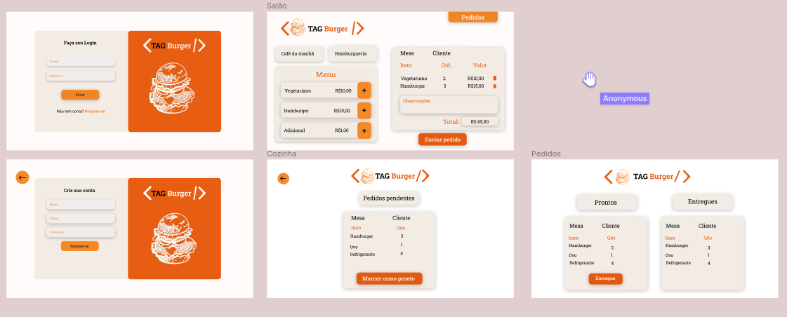

## About Project

Um pequeno restaurante de hambúrgueres, que está crescendo, necessita uma interface em que se possa realizar pedidos utilizando um tablet, e enviá-los para a cozinha para que sejam preparados de forma ordenada e eficiente.

> Para acessar a plataforma clique [aqui](https://tag-burger.vercel.app/)! :hamburger:

__Somos TAG Burger, um fast food 24hrs__

A nossa proposta de serviço 24 horas foi muito bem recebida e, para continuar a crescer, precisamos de um sistema que nos ajude a receber pedidos de nossos clientes.

__Nós temos 2 menus.__
_Um muito simples para o café da manhã:_

| Itens | Valor |
| ----------- | ----------- |
| Café americano | 5,00 |
| Misto Quente| 10,00 |
| Suco de fruta natural| 7,00 |

__E outro menu para o resto do dia:__

| Hambúrgueres | Valor |
| ----------- | ----------- |
| Hambúrguer simples| 10,00|
| Hambúrguer duplo	| 15,00|
| Acompanhamentos	| 1,00 |
| Batata frita	    | 5,00 |
| Anéis de cebola	| 5,00 |
| Bebidas	        |__Valor__|
| Água 500ml        | 5,00 |
| Água 750ml	    | 7,00 |
| Refrigerante 500ml| 7,00 |
| Refrigerante 750ml| 10,00 |
|

### Histórias de Usúario

__[História de usuário 1] Usuário deve ter seu perfil (login/senha) para acessar o sistema.__
Eu como funcionário do restaurante quero entrar na plataforma e ver apenas a tela importante para o meu trabalho.

_Critérios de aceitação_
- O que deve acontecer para satisfazer as necessidades do usuário?

- Criar login e senha.
- Registar tipo de usuário (cozinha / salão), login e senha.
- Entrar na tela correta para cada usuário.
- Definição de pronto
- O acordado abaixo deve acontecer para dizer que a história está terminada:

__[História de usuário 2] Garçom/Garçonete deve poder anotar o seu pedido.__
Eu como garçom/garçonete quero poder anotar o meu pedido saber o valor de cada produto e poder enviar o pedido para a cozinha para ser preparado.

_Critérios de aceitação_
- O que deve acontecer para satisfazer as necessidades do usuário?

- Anotar o nome e mesa.
- Adicionar produtos aos pedidos.
- Excluir produtos.
- Ver resumo e o total da compra.
- Enviar o pedido para a cozinha (guardar em algum banco de dados).
- Funcionar bem e se adequar a um tablet.

__[História de usuário 3] Chefe de cozinha deve ver os pedidos.__
Eu como chefe de cozinha quero ver os pedidos dos clientes em ordem, poder marcar que estão prontos e poder notificar os garçons/garçonetes que o pedido está pronto para ser entregue ao cliente.

_Critérios de aceitação_
- Ver os pedidos à medida em que são feitos.
- Marcar os pedidos que foram preparados e estão prontos para serem servidos.
- Ver o tempo que levou para preparar o pedido desde que chegou, até ser marcado como concluído.

__[História de usuário 4] Garçom/Garçonete deve ver os pedidos prontos para servir.__
Eu como garçom/garçonete quero ver os pedidos que estão prontos para entregá-los rapidamente aos clientes.

_Critérios de aceitação_
- Ver a lista de pedidos prontos para servir.
- Marque os pedidos que foram entregues.

###Protótipo

> Protótipo criando com a ferramenta [Figma](https://www.figma.com/file/5kMPXjESmGvKjwH5eiLpfy/TAG-Burger?node-id=0%3A1)

####Paleta de cores da aplicação.

__Developer by:__
[Nicaely Joane](https://github.com/Nijoane)
[Priscila Silveira](https://github.com/PriscilaSSilveira)

-----

Thank you! :smile: